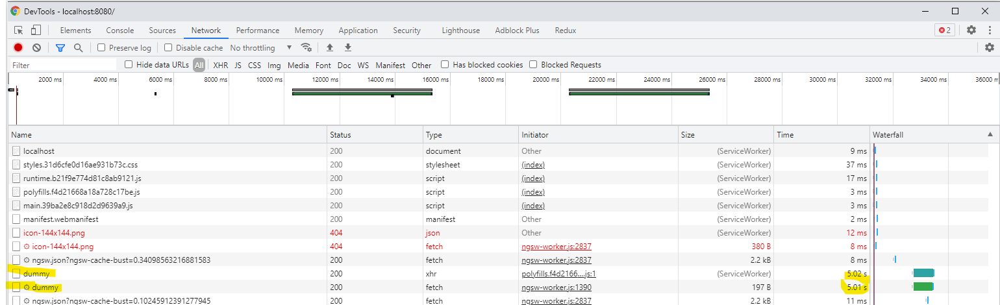

1. Install Maven 3.6.x
2. Install OpenJDK 16
3. Run ``mvn spring-boot:run``
4. Open ``localhost:8080`` in the browser
5. Open the DevTools 
6. Wait until ``Hello World!`` is displayed after ``Running...``
7. See that the ``/dummy`` request takes 5 seconds, although timeout is set to 1 second (``/dummy`` is queried every 10 seconds)
   